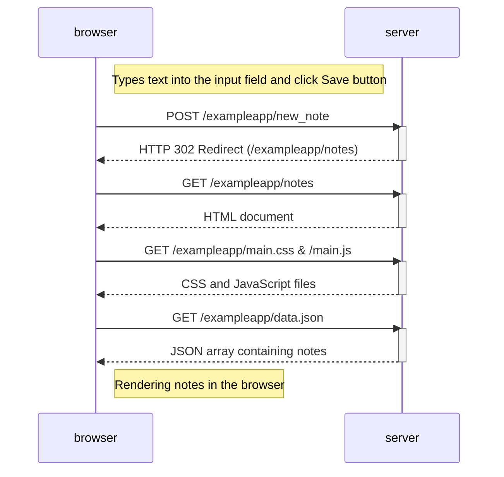

```mermaid
sequenceDiagram
    participant browser
    participant server

    Note right of browser: Types text into the input field and click Save button

    browser->>server: POST /exampleapp/new_note
    activate server
    
    server-->>browser: HTTP 302 Redirect (/exampleapp/notes)
    deactivate server

    browser->>server: GET /exampleapp/notes
    activate server
    server-->>browser: HTML document
    deactivate server

    browser->>server: GET /exampleapp/main.css & /main.js
    activate server
    server-->>browser: CSS and JavaScript files
    deactivate server

    browser->>server: GET /exampleapp/data.json
    activate server
    server-->>browser: JSON array containing notes
    deactivate server

    Note right of browser: Rendering notes in the browser
```

