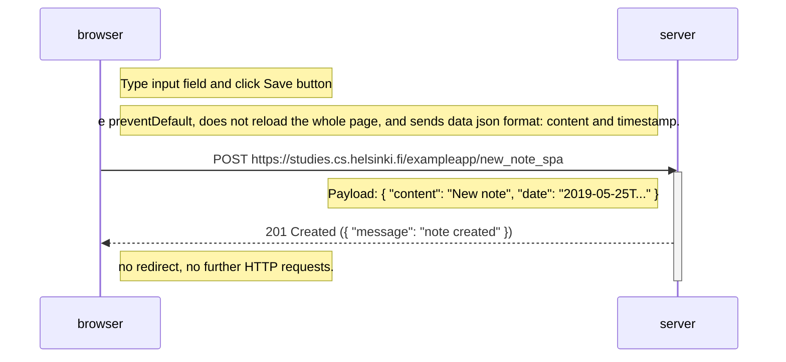

```mermaid
sequenceDiagram
    participant browser
    participant server

    Note right of browser: Type input field and click Save button
    Note right of browser: e preventDefault, does not reload the whole page, and sends data json format: content and timestamp.

    browser->>server: POST https://studies.cs.helsinki.fi/exampleapp/new_note_spa
    activate server
    Note left of server: Payload: { "content": "New note", "date": "2019-05-25T..." }
    server-->>browser: 201 Created ({ "message": "note created" })
    Note right of browser: no redirect, no further HTTP requests.
    deactivate server
```
